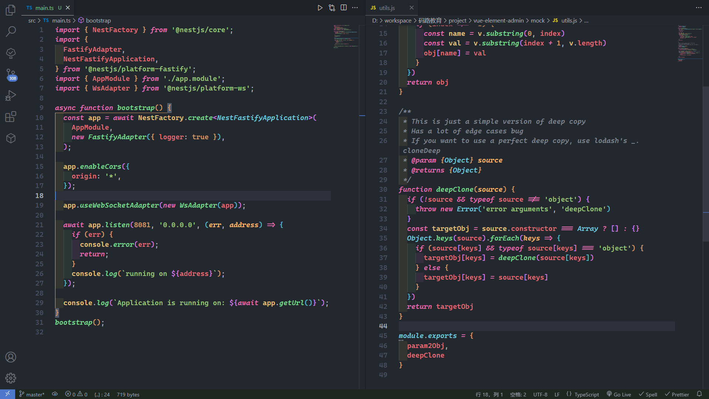

# preview



---

## 中文

- [英文-English](#English)

### 说明

One Dark Theme 和 Dracula Theme 混合

字体推荐(建议使用连字字体)

- [Cascadia code](https://github.com/microsoft/cascadia-code/releases)
- [Nerd Fonts](https://www.nerdfonts.com/)

Visual Studio Code 开启连字字体显示

- setting.json

```json
"editor.fontLigatures": true,
```

---

## English

- [中文-zh_CN](#中文)

### description

A mix of One Dark Theme and Dracula Theme

Font recommendations (ligature fonts are recommended)

- [Cascadia code](https://github.com/microsoft/cascadia-code/releases)
- [Nerd Fonts](https://www.nerdfonts.com/)

Visual Studio Code Enable ligature font display

- setting.json

```json
"editor.fontLigatures": true,
```

## License

[MIT](https://opensource.org/licenses/MIT)
